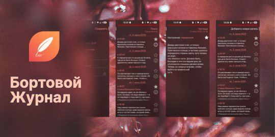

<!--
SPDX-FileCopyrightText: 2025 Smooth-E
SPDX-FileCopyrightText: 2018-2025 Mirian Margiani
SPDX-License-Identifier: GFDL-1.3-or-later
-->



# Бортовой журнал для ОС Аврора

Бортовой журнал - простое приложение-дневник для записи ваших мыслей.

Этот репозиторий содержит модифицированный код версий 2.0.0 и новее приложения [Captain's Log для SailfishOS](https://github.com/ichthyosaurus/harbour-captains-log). Оригинальное приложение разрабатывалось [AlphaX2](https://github.com/AlphaX2/) и код предыдущих версий доступен [тут](https://github.com/AlphaX2/Captains-Log-Sailfish).

## Функционал

- Защита дневника паролем
- Закладки
- Тэги для заметок
- Ищите ваши заметки, используя различные фильтры
- Экспортируйте дневник в разные форматы

**Примечание:** Бортовой журнал может скрыть ваш дневник за экраном ввода пин-кода, но это никак не защищает ваши заметки от злоумышленников с физическим (или по SSH) доступом к вашему устройству, так как заметки не шифруются.

### Запланированный функционал

- Прикрепление картинок к заметкам
- Голосовые заметки
- Улучшение переводов

## Разрешения

Приложению Бортовой журнал требуются следующие разрешения:

- Документы: позволяет экспортировать дневник в различных форматах

## Поддержать проект

Если у вас есть какие-то вопросы, предложения или вы столкнулись с проблемой при использовании приложения на ОС Аврора, пожалуйста, оставляйте свои комментарии в [трекере GitHub Issues этого репозитория](https://github.com/Smooth-E/aurora-captains-log/issues).

## Сборка и предложение изменений

*Не стесняйтесь сообщать о проблемах и предлагать свои изменения!*

1. Клонируйте этот репозиторий
   ```sh
   git clone --recurse-submodules https://github.com/Smooth-E/aurora-captains-log
   ```
2. Примените необходимые патчи
   ```sh
   git apply libs/*.patch
   ```
3. Соберите проект при помощи вашей версии Aurora SDK. Рекомендуется использовать Aurora SDK MB2 Tools на Linux или внутри WSL. На других конфигурациях возможность сборки проекта не проверяется, но вы всегда можете предложить необходимые исправления для работы в вашем окружении.

Если вы предлагаете изменения - не забудьте упомянуть себя на странице [`AboutPage`](qml/pages/AboutPage.qml)!

## Финансовая поддержка

Вы можете поддержать разработчика оригинального приложения, [пожертвовав через Liberapay](https://liberapay.com/ichthyosaurus).

Вы можете поддержать разработчика порта для ОС Аврора, [пожертвовав через Boosty](https://boosty.to/smooth-e/donate).

Конечно же, мы будем очень рады, если вы поможете проекту, предложив свои правки или улучшения. Прочтите секцию выше, чтобы узнать больше ✨

## Лицензирование

- Copyright (С) 2025 Smooth-E
- Copyright (C) 2020-2025  Mirian Margiani
- Copyright (C) 2020  AlphaX2

Бортовой журнал - свободное программное обеспечение, которое распространяется под лицензией 
[GNU General Public License v3 (or later)](https://spdx.org/licenses/GPL-3.0-or-later.html).
Исходный код доступен [на Github](https://github.com/Smooth-E/aurora-captains-log).
Вся сопутствующая документация распространяется под лицензией 
[GNU Free Documentation License v1.3 (or later)](https://spdx.org/licenses/GFDL-1.3-or-later.html).
